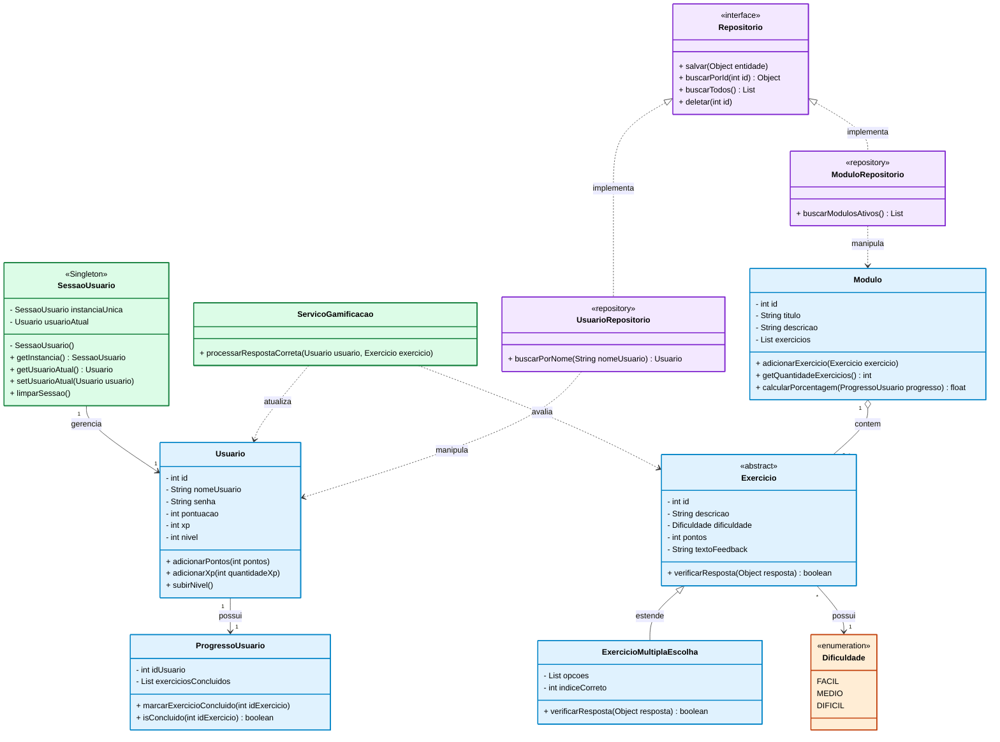

# 🎮 AlgoQuest


> Transformando o aprendizado de Algoritmos e Estruturas de Dados em uma experiência gamificada e interativa.

## 📖 Sobre o Projeto

O **AlgoQuest** é um software educacional desenvolvido como projeto acadêmico. 

**O Problema:** Muitos conteúdos relacionados à área de algoritmos (como notação Big O, árvores e tabelas hash) são apresentados de maneira excessivamente teórica e abstrata. Textos longos, fórmulas e exercícios tradicionais muitas vezes não são suficientes para a visualização clara de como as estruturas funcionam.

**A Solução:** O AlgoQuest transforma esses conteúdos em uma experiência dinâmica. O usuário assume o papel de um estudante/desenvolvedor que precisa resolver diferentes desafios computacionais. Em vez de uma prova tradicional, o sistema apresenta problemas contextuais, oferece feedback visual e gamifica o acerto.

---

## 🧠 Estrutura Educacional (Módulos)

O conteúdo é organizado em trilhas de aprendizagem. Nossos módulos iniciais planejados incluem:

*   📊 **Análise de Algoritmos:** Notação Big O (O(1), O(n), O(log n), etc).
*   🔎 **Algoritmos de Busca:** Busca sequencial vs. Busca binária.
*   🔃 **Algoritmos de Ordenação:** Bubble, Selection, Insertion, Merge e Quick Sort.
*   #️⃣ **Tabelas Hash:** Funções, colisões e endereçamento.
*   🌳 **Estruturas de Dados:** Árvores binárias, de busca e balanceamento.

---

## 🎮 A Experiência do Usuário (Gamificação)

A gamificação existe para incentivar, sem tornar o sistema um jogo complexo. O fluxo padrão consiste em:

1. **Escolha do Módulo:** O usuário acessa seu painel e visualiza seu progresso (ex: *Busca: 90% concluído*).
2. **O Desafio:** O sistema apresenta um cenário (ex: *"Você tem 1.000.000 de elementos ordenados. Como achar um valor rapidamente?"*).
3. **Resolução e Feedback:** Após a resposta, o sistema não apenas diz se está certo ou errado, mas fornece uma **explicação educacional**.
4. **Recompensa:** Acertos geram pontos baseados na dificuldade (Fácil: +10, Médio: +20, Difícil: +30) e aumentam o XP/Nível do perfil.

---

## 🏗️ Arquitetura e Modelagem (MVP)

Para garantir que o projeto não fuja do escopo de estudantes e permita a aplicação de **Boas Práticas de POO** e **Design Patterns**, focamos em uma arquitetura limpa (MVC-like) dividida em:
1. **Camada de Dados:** Uso do padrão *Repository* para isolar o salvamento de dados (JSON/Memória inicial).
2. **Camada de Modelo:** Entidades coesas (`Usuario`, `Modulo`, `Exercicio`).
3. **Camada de Serviço:** Centralização de regras (ex: `ServicoGamificacao`) e sessão global via padrão *Singleton*.

### Diagrama de Classes UML
*(Este diagrama é gerado automaticamente pelo GitHub ao visualizar este arquivo!)*



---

## 🚀 Próximos Passos & Integração com IA

Nossa estratégia de desenvolvimento será feita em fases. Após garantirmos que o **"Motor" em Java** (classes, lógica, cálculo de pontos) esteja rodando perfeitamente, partiremos para o **Front-end**.

Para a construção da Interface Gráfica e design visual, utilizaremos **Inteligência Artificial** para auxiliar na prototipação das telas, geração de componentes e criação de um futuro "Laboratório de Algoritmos" (para visualização passo a passo do código). 

A ideia é ter um backend robusto e bem padronizado em POO, sustentando um front-end moderno e atraente gerado com auxílio de IA.

---

## 🛠️ Como Contribuir e Executar

1. Faça o clone do repositório:
   ```bash
   git clone https://github.com/SEU_USUARIO/AlgoQuest.git
   ```
2. Abra o projeto na sua IDE favorita (VS Code, IntelliJ, Eclipse).
3. Crie uma branch para sua funcionalidade:
   ```bash
   git checkout -b feature/minha-funcionalidade
   ```
4. Siga as separações de pacotes da arquitetura proposta.
5. Faça o commit e abra um Pull Request!

---

👨‍💻 **Equipe:** Nygel & Antônio
